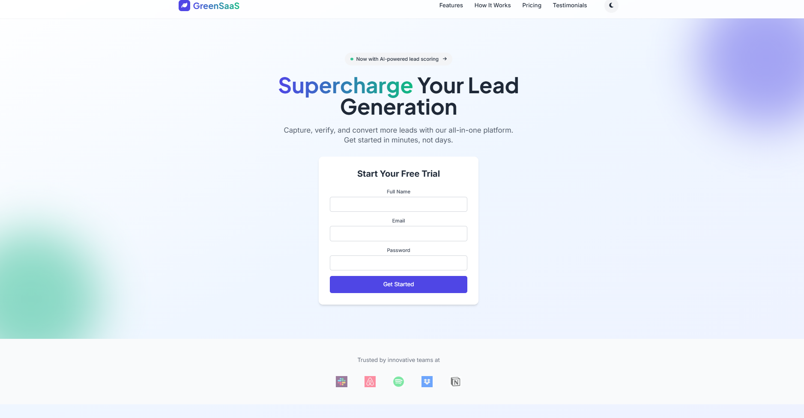

# 🌿 GreenSaaS Landing Page

A modern SaaS-style landing page with sign-up, email verification, and lead storage using MongoDB.



---

## 🔗 Live Demo

👉 [View Live Deployment](https://greensaas.onrender.com/)

---

## ✨ Features

- 💻 Responsive, conversion-focused design  
- 🔒 Secure sign-up with email validation  
- 📧 Email verification using unique tokens via Nodemailer  
- 🗃️ Lead data stored in MongoDB Atlas  
- 🎉 Thank-you dashboard after successful verification  
- 📱 Mobile-friendly layout  

---

## 🛠️ Tech Stack

| Category       | Technology |
|----------------|------------|
| Frontend       | HTML, [Tailwind CSS](https://tailwindcss.com/) |
| Backend        | Node.js, [Express](https://expressjs.com/) |
| Database       | [MongoDB Atlas](https://www.mongodb.com/cloud/atlas) |
| Email Service  | [Nodemailer](https://nodemailer.com/about/) (Gmail SMTP) |
| Templating     | [EJS](https://ejs.co/) |

---

## 🚀 Getting Started

### Prerequisites

- Node.js (v14+ recommended)
- A MongoDB Atlas account
- A Gmail account with [App Passwords enabled](https://support.google.com/accounts/answer/185833)

### Installation

1. **Clone the repository**
   ```bash
   git clone https://github.com/ArchieP27/GreenSaaS-Landing-Page.git
   cd GreenSaaS-Landing-Page
2. **Install dependencies**
   ```bash
   npm install
4. **Create a .env file in the root directory:**  
   ```bash
   PORT=3000  
   MONGO_URI=your_mongodb_connection_string  
   EMAIL_USER=your_email@gmail.com  
   EMAIL_PASS=your_gmail_app_password  
   BASE_URL=https://your-app.onrender.com  
5. **Run the server locally**
   ```bash
   node server.js

---

## 🔗 Useful Links & References
- 🌐 [Tailwind CSS](https://tailwindcss.com/)
- 📦 [Nodemailer](https://nodemailer.com/about/)
- ☁️ [MongoDB Atlas](https://www.mongodb.com/products/platform/atlas-database)
- 🚀 [Render Deployment Guide](https://render.com/docs/deploy-node-express-app)
- 🎨 [Font Awesome](https://fontawesome.com/)
- 🔤 [Google Fonts](https://fonts.google.com/)
- 📝 [EJS Templating](https://ejs.co/)

---
